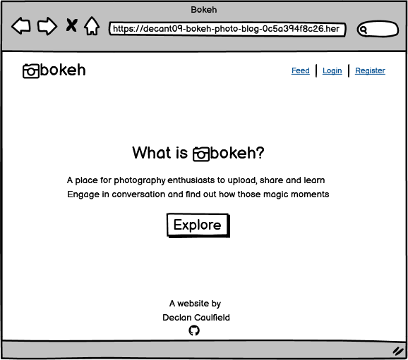
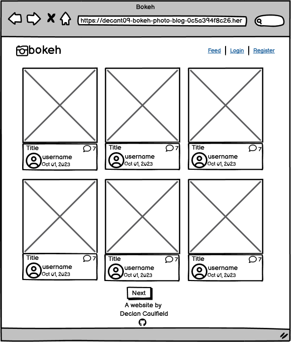

# Bokeh Photography Blog
<!-- Learn the Lingo Quiz is a quiz based learning modality for users to test their knowledge of the local tongue. It is a quiz based
game whereby you are presented with a phrase, or term, with four possible answers to choose from. It is aimed at people who are
interested in the fun of linguistics and want to learn the local lingo. -->

  

To visit the live link to bokeh on Heroku click [here](#).  

## Contents
- [User Experience](#user-experience)
    - [Initial Discussion](#initial-discussion)
    - [User Stories](#user-stories)
        - [First Time Visitor Goals](#first-time-visitor-goals)
        - [Returning Visitor Goals](#returning-visitor-goals)
        - [Frequent Visitor Goals](#frequent-visitor-goals)
    - [Design](#design)
        - [Colour Scheme](#colour-scheme)
        - [Typography](#typography)
        - [Wireframes](#wireframes)
- [Features](#features)
    - [Home Page](#home-page)
    - [Quiz Page](#quiz-page)
    - [Quiz Over Page](#quiz-over-page)
    - [Future Features](#future-features)
- [Technologies Used](#technologies-used)
    - [Languages](#languages)
    - [Frameworks](#frameworks)
    - [Database](#database)
    - [Libraries and Packages](#libraries-and-packages)
    - [Programs](#programs)
- [Testing](#testing)
    - [W3C Validator](#w3c-validator)
        - [HTML](#html)
        - [CSS](#css)
    - [JShint](#jshint)
        - [JavaScript](#javascript)
    - [Accessibility](#accessibility)
        - [WebAIM](#webaim)
        - [Google Lighthouse](#google-lighthouse)
    - [Manual](#manual)
    - [Testing User Stories from User Experience (UX) Section](#testing-user-stories-from-user-experience-ux-section)
        - [First Time Visitor Goals](#first-time-visitor-goals-1)
        - [Returning Visitor Goals](#returning-visitor-goals-1)
        - [Frequent Visitor Goals](#frequent-visitor-goals-1)
    - [Bugs](#bugs)
        - [Known](#known)
        - [Solved](#solved)
- [Deployment and Local Development](#deployment-and-local-development)
    - [Deployment](#deployment)
    - [Local Development](#local-development)
        - [How to Fork](#how-to-fork)
        - [How to Clone](#how-to-clone)
- [Credits](#credits)
    - [Code Used](#code-used)
    - [Resources](#resources)
    - [Acknowledgements](#acknowledgements)
## User Experience

### Initial Discussion
This website was created for a project submission to Code Institute for the Diploma in Full Stack Software Development
(E-commerce Applications). The criteria for the submission were primarily that it be created using the Bootstrap and Django
frameworks. It was also required to have create, read, update and delete (CRUD) funtionality for users who visit the website. We were presented with a few website formats to choose from and of these I chose a blog based format. I chose a photography based blog format as I have an interest in photography and having a website where users can share their expertise was one that appealed to me. Learning the basics of photography is a challenge and having a forum to pick up some tips from others with greater experience would be a great resource. The aim was to develop a blog that will either help people to have some fun or help to improve their understanding of photography.  

### User Stories
#### First Time Visitor Goals
- I want to know what the website is about upon arriving.
- I want the website to be easily navigatable.
- I want any links to be obvious by changing appearance once hovered over.
- I want the website to be responsive to the device screen size that I am using.
- I want to be able to explore the website without registering or signing up.
- I want a feed page to display all posts with the most recent posts to be displayed at the top.
- I want the feed page to be paginated to that I don't hhve to scroll to see all posts.
- I want to be able to enlarge post images to the see the detail more clearly.
- I want to see who made the post, and when, by having a username, profile image and date displayed beside the post.
- I want the post to have a title.
- I want to see if there are any comments on the post and for that to be visible with an icon showing the number of comments beside it.
- I want to be able to navigate to where the comment content is displayed and for the oldest comment to be displayed at the top.
- I want to see if the author has posted a description or any extra information regarding the photo.
- If I like a particular photo I want to see all of the photos by that author on its own paginated page.
#### Returning Visitor Goals
- I want to be able to register to the website and signin so that I can access extra features.
- I want a message to be displayed if I haven't completed the signup process correctly and what actions I need to take.
- I want to be able to signout so that my account is secured.
- I want success messagest to appear on signing in and out.
- I want a profile to be automatically created once I register.
- I want a default profile image to be displayed if I do not want to upload an image to my profile.
- I want to have a username and not have to supply my first and last names.
- I want only registered users to be able to contribute posts to the website.
- I want only registered users to be able to comment on posts.
#### Frequent Visitor Goals
- I want to have autonomy over posts I have made and be able to update or delete them if I desire.
- I want to have autonomy over comments I have made and be able to delete them if I desire.
- I want a page to be displayed if I click the delete icon warning me that I am about to delete content before I proceed.
- I want success messages to appear when I have created, updated ot deleted content.
- I want the comments to need prior approval from the admin before appearing on the website.
- I want to be able to delete my profile (future implementation).
- I want to be able to create posts with a category attached so that I can see all posts in a given category in one location. (future implementation)
- I want to be able to add a post to my favourites so that I can view all my favourite posts in one location (future implementation)
### Design
#### Colour Scheme
I opted for a neutral colour scheme throughout the website mainly using greys, whites, and blacks. I opted for this approach because the photography is the core feature of the website. The photography will supply a splash of colour and the neutral surrounds will help to highliht it.
I used a soft green colour to highlight the messages that are displayed to the user when they have performed actions successfully. I used red when highlighting actions that need to be addressed by the user, for example during the authentication process. I also used red as a warning colour to alert the user then they are about to delete content.
#### Typography
I chose to use the default font supplied with Bootstrap as I found it to be simple and geometrically attractive. I wanted a simple font where readability was a strong characteristic. I didn't want to use a font that overly styled so as not to detract from the photography posts.  
#### Wireframes
Wireframes were created for the website layout. The layout is the same across different device screen sizes with the exception of the post list page. On small screen sizes the posts are in displayed in a single column as opposed to three columns on larger devices. The navigation links are also compressed into a dropdown menu on small screen sizes. I have included a mobile wireframe to show these representations.

Landing Page

Post List Page

Post List Page Mobile

Post Detail Page

Profile Page

Create Post Page

Post Delete Page

Comment Delete Page

Update Post Page

User Post List Page

Signup Page

Login Page

Logout Page

  

## Features
- The website is made up of three pages, the home page, the quiz page, and the quiz over page. The home page contains a start
button, that takes you to the quiz itself, and a rules button, that shows the rules in a modal. When the quiz is complete, the quiz
over page is automatically opened. This page contains buttons to navigate back to the home page or to the quiz page again.
### Home Page  
- The home page displays the title of the website clearly.
- Below this, there is a brief introduction to the website and an invitation to take the quiz.
- Below the introduction, there is a button labelled "start" that when clicked takes you to the quiz page.
- Below the start button, there is a button labelled "rules". When clicked, a modal appears with the rules. The main background behind
the modal darkens making the modal the focus of the page when open. The modal has a close button that when clicked closes the modal.
Clicking any area outside the modal will also close it.
- The buttons are styled with a box shadow to make them stand out as buttons. There is a hover effect applied that changes the cursor
to a pointer and makes the button pop up a fraction. This gives the appearance of it moving in a 3D direction out of the screen.
- There is a dark mode toggle icon to allow the user to change between the default light mode to dark mode. This is displayed on each
of the pages of the website.  
  
  
### Quiz Page
- The quiz page is made up of a quiz area with a shadow effect border applied.
- Within this area, there are three main components, the quiz head, the question display, and the associated answers options.
- The quiz head, located at the top, contains a question count to the left and a score count to the right.
- The question counter contains two numbers separated by a forward slash. These are placed under the heading labelled "question".
The first number is a number between 1 and 5 and is assigned depending on what question number point the user is at in the quiz.
The second number is 5 and corresponds to the total amount of questions in the quiz. This shows the user that there are 5 questions
in total and how far they have progressed. When the page is loaded the question counter displays 1/5.
- The score counter is placed under the heading labelled "score". It starts at 0 and increments by 20 as questions are answered
correctly.
- The question area displays the new question each time it is prompted to, this being when the page is loaded and when an answer
option has been clicked.  
  
- Each question has its associated answers displayed below it. There are 4 possible answer choices of which only one is right. A
hover effect is applied to the areas containing the answers. This results in the cursor changing to a pointer and the colour scheme
of the area changing.  
  
- Once an answer option is chosen and clicked on the background colour changes to green if the answer selected is correct, and red if
incorrect. There is a brief delay applied before the next question is automatically displayed.  
  
  
- The quiz is complete once 5 questions have been answered prompting the quiz over page to be displayed.  

### Quiz Over Page
- This page shows the user's score result with a message displayed beneath.
- The message displayed depends on the score achieved. There are three possible messages, one for achieving a result of 100/100, one
for over 50/100 but less than 100, and finally one for all other results, in other words results less than 50/100.
- There are two buttons displayed underneath stacked on top of each other. They have the same styling and hover effect applied to
them as the start button on the home page.
- The first button is labelled "try again" and when clicked takes you to the start of the quiz again.
- The second button is labelled "home" and when clicked takes you to the home page.  
  
  
  

### Future Features
- The website is based on the Scottish linguistic variation of English, as well as its regional dialects. However, on a similar
basis, I would like to include England and Ireland specific quizzes.
- The structure would be the same, but instead, the homepage would be modified to add buttons that would allow the user to choose the
England, Ireland, or Scotland quiz option.
- At the outset of creating this website I intended to have a leaderboard feature that would display the top three scores achieved
by users. However, time constraints meant that I had to remove this feature from the website as it was not fully complete by the
time of submission.
##  Technologies Used
### Languages
- HTML5
- CSS3
- JavaScript
- Python3
### Frameworks
- [Django 3.2.22](https://www.djangoproject.com/)
    - Python web framework used to develop the website.
- [Bootstrap](https://getbootstrap.com/docs/5.0/getting-started/introduction/)
    - Responsive CSS framework used to develop the website.
### Database
- [ElephantSQL](https://www.elephantsql.com/)
    - Used to host the PostgreSQL database.
### Libraries and Packages
- [Django Allauth](https://pypi.org/project/django-allauth/)
    - Used for the authentication system.
- [Django Crispy Forms](https://django-crispy-forms.readthedocs.io/en/latest/)
    - Used to control the rendering behaviour of forms.
- [Gunicorn](https://pypi.org/project/gunicorn/)
    - Python WSGI HTTP Server.
- [Psycopg2](https://pypi.org/project/psycopg2/)
    - Python-PostgreSQL Database Adapter.
- [Cloudinary](https://cloudinary.com/)
    - Cloud based image management system used for managing the images.
### Programs
- [Jinja](https://jinja.palletsprojects.com/en/3.1.x/)
    - Templating engine to allow writing code similar to Python syntax.
- [Heroku](https://www.heroku.com/)
    - Used to deploy the project.
- Git
    - Used for version control by utilising the Gitpod and Codeanywhere terminals to commit to Git and push to GitHub.
- GitHub
    - Used to store the code of the project after being pushed from Git.
- [Icons8](https://icons8.com/icons/set/camera-favicon).
    - Used to obtain the browser icon to be displayed in the browser tab.
- [Convertico](https://convertico.com/).
    - Used to convert a png file to ico file for the favicon.
- [Balsamiq](https://balsamiq.com/)
    - Used to generate the wireframes for the design of the website.
- [Font Awesome](https://fontawesome.com/)
    - Used for the camera logo, github logo, comments, edit and delete icons.
- Google Dev Tools
    - Used for responsiveness investigations, isolating code, troubleshooting, and testing features.
- [Am I Responsive]()
    - Used to show responsiveness across different device sizes.
- [Pip](https://pypi.org/project/pip/)
    - For installing python packages
## Testing

### W3C Validator
#### HTML
- Base template (base.html)
    - Result - No errors or warnings to show.
    
- Comment Delete Page (comment_confirm_delete.html)  
  - Result - No errors or warnings to show.  
    
- Landng Page (index.html)  
    - Result - No errors or warnings to show.  
    
- Post Delete Page (post_confirm_delete.html)  
    - Result - No errors or warnings to show.  
    
- Post Detail Page (post_detail.html)  
    - Result - No errors or warnings to show.  
    
- Post Edit Page (post_edit.html)  
    - Result - No errors or warnings to show.  
    
- Post Form Page (post_form.html)  
    - Result - No errors or warnings to show.  
    
- Feed Page (post_list.html)  
  - Result - No errors or warnings to show.  
    
- Profile Page (profile.html)  
    - Result - No errors or warnings to show.  
    
- User Post List Page (user_post_list.html)  
  - Result - No errors or warnings to show.  
      
- Signup Page (signup.html)  
  - Result - No errors or warnings to show.  
      
- Login Page (login.html)  
  - Result - No errors or warnings to show.  
      
- Logout Page (logout.html)  
  - Result - No errors or warnings to show.  
      
#### CSS
- Style Sheet
    - Result - No errors found.  
      
### JShint
#### JavaScript
- Script
    - Result - No errors or warnings.  
      
### Accessibility
#### WebAIM
- I tested the contrast of the font colours used against their respective background colours using WebAIM.
- Black text on light grey background
    - [Result]() - # - Pass.  

#### Google Lighthouse
Google Lighthouse was used to test for accessibility for each page.
- Base template (base.html)
    - Result - #  
    
- Comment Delete Page (comment_confirm_delete.html)  
  - Result - #  
    
- Landng Page (index.html)  
    - Result - #  
    
- Post Delete Page (post_confirm_delete.html)  
    - Result - #  
    
- Post Detail Page (post_detail.html)  
    - Result - #  
    
- Post Edit Page (post_edit.html)  
    - Result - #  
    
- Post Form Page (post_form.html)  
    - Result - #  
    
- Feed Page (post_list.html)  
  - Result - #  
    
- Profile Page (profile.html)  
    - Result - #  
    
- User Post List Page (user_post_list.html)  
  - Result - #  
    
- Signup Page (signup.html)  
  - Result - #  
      
- Login Page (login.html)  
  - Result - #  
      
- Logout Page (logout.html)  
  - Result - #  
       
### Manual
- I used Google Dev Tools to test for screen responsiveness.  
  
- I tested on different browsers (chrome, firefox, safari and edge) to ensure the website performs as expected across all of these.
- I tested on Android and iPhone devices.
- I tested all the buttons and answer fields on the website manually to ensure that they all work as expected. Upon hovering over
them the desired effect is realised. The main buttons redirect appropriately to the website areas they are linked to. The answer
fields behave as intended.
- I spellchecked the website and the readme using [Online Spellcheck](https://www.online-spellcheck.com/). I also used
[Webpage Spell-Check](https://chrome.google.com/webstore/detail/webpage-spell-check/mgdhaoimpabdhmacaclbbjddhngchjik), a google chrome extension.
- I used [Grammarly](https://www.grammarly.com/) to check for grammatical errors.

### Testing User Stories from User Experience (UX) Section
#### First Time Visitor Goals
- I want to know what the website is about upon arriving.
  - ...
    
- I want the website to be easily navigatable.
- I want any links to be obvious by changing appearance once hovered over.
- I want the website to be responsive to the device screen size that I am using.
- I want to be able to explore the website without registering or signing up.
- I want a feed page to display all posts with the most recent posts to be displayed at the top.
- I want the feed page to be paginated to that I don't hhve to scroll to see all posts.
- I want to be able to enlarge post images to the see the detail more clearly.
- I want to see who made the post, and when, by having a username, profile image and date displayed beside the post.
- I want the post to have a title.
- I want to see if there are any comments on the post and for that to be visible with an icon showing the number of comments beside it.
- I want to be able to navigate to where the comment content is displayed and for the oldest comment to be displayed at the top.
- I want to see if the author has posted a description or any extra information regarding the photo.
- If I like a particular photo I want to see all of the photos by that author on its own paginated. 
#### Returning Visitor Goals
- I want to be able to register to the website and signin so that I can access extra features.
- I want a message to be displayed if I haven't completed the signup process correctly and what actions I need to take.
- I want to be able to signout so that my account is secured.
- I want success messagest to appear on signing in and out.
- I want a profile to be automatically created once I register.
- I want a default profile image to be displayed if I do not want to upload an image to my profile.
- I want to have a username and not have to supply my first and last names.
- I want only registered users to be able to contribute posts to the website.
- I want only registered users to be able to comment on posts.
#### Frequent Visitor Goals

- I want to have autonomy over posts I have made and be able to update or delete them if I desire.
- I want to have autonomy over comments I have made and be able to delete them if I desire.
- I want a page to be displayed if I click the delete icon warning me that I am about to delete content before I proceed.
- I want success messages to appear when I have created, updated ot deleted content.
- I want the comments to need prior approval from the admin before appearing on the website.
- I want to be able to delete my profile (future implementation).
- I want to be able to create posts with a category attached so that I can see all posts in a given category in one location. (future implementation)
- I want to be able to add a post to my favourites so that I can view all my favourite posts in one location (future implementation)

### Bugs
#### Known
- ...
#### Solved
- After I created the user profile page I noticed I had set the email field to required. The user could not update their profile without supplying an email. However, during the registraion process you were not required to supply an email. I decided to have the email field as part of the registraion process by setting ACCOUNT_EMAIL_REQUIRED=True. This ensured continuity between the two areas. I referred to the [Django Allauth](https://docs.allauth.org/en/latest/account/configuration.html) configuration documentation to achieve this.
- When uploading image files as a user on the website with a form I was encountering a "No file chosen" message. This was because I hadn't included the enctype="multipart/form-data" inside the form tag which I learned by reading this [stackoverflow](https://stackoverflow.com/questions/70566852/why-i-am-getting-no-file-chosen-error-while-uploading-image-in-django) conversation.
- When creating a post as a user I noticed slug field was not being created. This was because I did not use slugify in the create_post view logic. I resolved this by referring to:
  - Creating a slug in Django on [stackoverflow](https://stackoverflow.com/questions/837828/how-do-i-create-a-slug-in-django)
  - Autogenerating the slug on [stackoverflow](https://stackoverflow.com/questions/68897050/slug-not-auto-generate-after-add-page-in-django)
- The comment count was displaying correctly on the post detail page however it was not displaying on the feed page. This was solved by accessing the value for the comment count by referring to the object (post) with "post.comment.count" instead of "comments.count" as used in the post detail page. This was achieved by reading the [stackoverflow](https://stackoverflow.com/questions/35941445/how-to-display-number-of-comments-in-django) thread on how to display the number of comments in Django.
- Upon clicking on the GitHub icon in the footer it would turn blue during the lagtime for the link to open. I used the :focus pseudo-class to resolve this from [stackoverflow](https://stackoverflow.com/questions/36644355/anchor-tag-colour-changes-to-blue-once-its-clicked).
- I was having issues with the navigation bar where the active attribute would not move accordingly. I was using if statements to refer to the url when applying the active attribute but it would stay on the Feed link in the navigation bar. I was able to resolve it by watching the [YouTube](https://www.youtube.com/watch?v=XqTmpbS7FJY&t=3s) video by Django World. I was able to use "request.path == /post-list/" within the if statement and then applying the relevant url segment for each link.
- I was having misleading logout messages appear on the landing page. This was because my landing page is a standalone page which does not use the base template. I had not included the messages code from the base template on the index page (landing page). I was able to solve this by reading the thread on [GitHub](https://github.com/pennersr/django-allauth/issues/2031
).

## Deployment and Local Development
### Deployment
The site was deployed to Heroku pages and the following steps were followed to do so:

[link to heroku]().

### Local Development
The steps below describe how to fork or clone the repository if desired.
#### How to Fork
1. Log in to Github.
2. Navigate to the [repository](https://github.com/decant09/learn-the-lingo-quiz) for this website.
3. Click the Fork button in the top right corner.
4. You will be brought to a new page with a short form to be completed.
5. Upon completing, click on the "Create fork" button and this will create a fork of the repository in your personal account.

#### How to Clone
1. Log in to GitHub.
2. Navigate to the [repository](https://github.com/decant09/learn-the-lingo-quiz) for this website.
3. Click on the Code button and a modal will appear.
4. Within this modal select the local tab.
5. Within this tab there are HTTPS, SSH, or GitHub CLI tabs.
6. Click on the HTTPS tab and copy the link shown.
7. In your development environment open the terminal.
8. Change the current working directory to the location where you want the cloned directory to be.
9. Type "git clone" into the terminal, then paste the URL you copied in step 6.
10. Press **Enter** to create your local clone.

## Credits
### Code Used
- To add the rules modal I used code from the [W3Schools'](https://www.w3schools.com/howto/howto_css_modals.asp) page:
    - How To Create a Modal Box.
- I used and modified code from LegionScript on [Medium](https://legionscript.medium.com/building-a-social-media-site-with-python-and-django-part-4-edit-delete-posts-add-comments-8e6ca1ef0441) to help with the logic for editing and deleting posts, and deleting comments.
- I used and modified some of the code from the Python Django Tutorial by Corey Schafer on [YouTube](https://www.youtube.com/watch?v=UmljXZIypDc).
### Resources
- The default profile placeholder image is from [Pixabay](https://pixabay.com/vectors/blank-profile-picture-mystery-man-973460/).
- Images uploaded for posts are from [Pexels](https://www.pexels.com/)
- To understand using get_absolute_url() and reverse() function I referred to [Stephen Nganaga's](https://ngangasn.com/what-is-get_absolute_url-in-django/?expand_article=1) article and [LearnDjango](https://learndjango.com/tutorials/django-best-practices-models).
- To get images in Bootstrap's card to be the same height/width I referred to [Stack Overflow](https://stackoverflow.com/questions/37287153/how-to-get-images-in-bootstraps-card-to-be-the-same-height-width).
- To force Bootstrap responsive image to be a square I referred to 
[Stack Overflow](https://stackoverflow.com/questions/23400232/force-bootstrap-responsive-image-to-be-square).
- When achieving the expand text on hover feature when hovering over the GitHub icon link in the footer I referred to [Codepen](https://codepen.io/shettytejas/pen/wvdVLwB).
- To have the footer remain at the bottom of the page using Bootstrap I referred to [Radu](https://radu.link/make-footer-stay-bottom-page-bootstrap/).
- For help creating a landing page and with the views.py and url.py code I referred to [DEV](https://dev.to/hmlon/creating-a-landing-page-in-django-20pg).
- To get the comment count to display I referred to Nutan on [Medium]().
- To help create the user profile model I referred to [PythonTutorial](https://www.pythontutorial.net/django-tutorial/django-user-profile/)
- I referred to the Pic Pals project by fellow Code Institute student Jamie King on [GitHub](https://github.com/jkingportfolio/CI_PP4_Pic_Pals/tree/main) as inspiration for some of the features and layout of my website.

### Acknowledgements
- My Mentor Chris Quinn for continuous helpful feedback.
- Tutor support at Code Institute for their amazing support.
- Alan Bushell at Code Institute for guiding the class in our weekly stand-ups.https://medium.com/@nutanbhogendrasharma/creating-a-comment-system-to-the-article-in-django-part-8-ba9d8067bb2