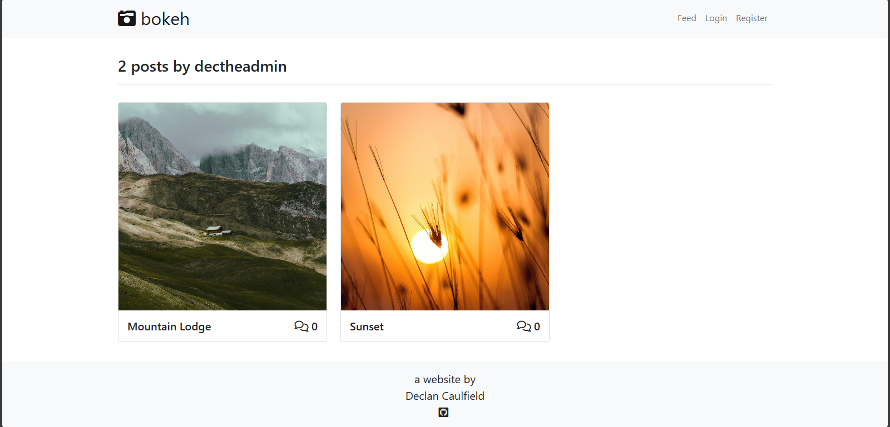
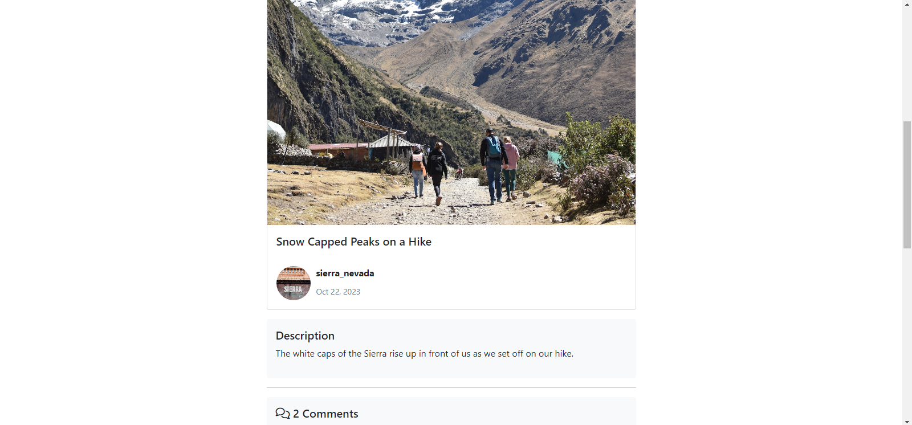
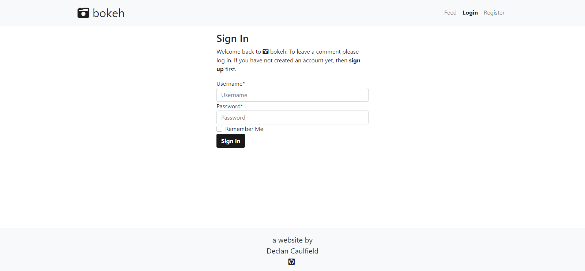

# Bokeh Photography Blog
What is  bokeh? A place for photography enthusiasts to upload, share and learn. Engage in conversation and find out how those magic moments were captured.

  

To visit the live link to bokeh on Heroku click [here](https://decant09-bokeh-photo-blog-0c5a394f8c26.herokuapp.com/).  

## Contents
- [Bokeh Photography Blog](#bokeh-photography-blog)
  - [Contents](#contents)
  - [User Experience](#user-experience)
    - [Initial Discussion](#initial-discussion)
    - [User Stories](#user-stories)
      - [First Time Visitor Goals](#first-time-visitor-goals)
      - [Returning Visitor Goals](#returning-visitor-goals)
      - [Frequent Visitor Goals](#frequent-visitor-goals)
    - [Design](#design)
      - [Colour Scheme](#colour-scheme)
      - [Typography](#typography)
      - [Wireframes](#wireframes)
      - [Database Schema](#database-schema)
  - [Features](#features)
    - [Landing Page](#landing-page)
    - [Post List Page](#post-list-page)
    - [User Post List Page](#user-post-list-page)
    - [Post Detail Page](#post-detail-page)
    - [Profile Page](#profile-page)
    - [Create Post Page](#create-post-page)
    - [Update Post Page](#update-post-page)
    - [Delete Post Page](#delete-post-page)
    - [Post Comments and Comment Form](#post-comments-and-comment-form)
    - [Signup Page](#signup-page)
    - [Login Page](#login-page)
    - [Logout Page](#logout-page)
    - [Future Features](#future-features)
  - [Technologies Used](#technologies-used)
    - [Languages](#languages)
    - [Frameworks](#frameworks)
    - [Database](#database)
    - [Libraries and Packages](#libraries-and-packages)
    - [Programs](#programs)
  - [Testing](#testing)
    - [W3C Validator](#w3c-validator)
      - [HTML](#html)
      - [CSS](#css)
    - [JShint](#jshint)
      - [JavaScript](#javascript)
    - [PEP8 Validator](#pep8-validator) 
    - [Accessibility](#accessibility)
      - [WebAIM](#webaim)
      - [Google Lighthouse](#google-lighthouse)
    - [Manual](#manual)
    - [Testing User Stories from User Experience (UX) Section](#testing-user-stories-from-user-experience-ux-section)
      - [First Time Visitor Goals](#first-time-visitor-goals-1)
      - [Returning Visitor Goals](#returning-visitor-goals-1)
      - [Frequent Visitor Goals](#frequent-visitor-goals-1)
    - [Bugs](#bugs)
      - [Known](#known)
      - [Solved](#solved)
  - [Deployment and Local Development](#deployment-and-local-development)
    - [Deployment](#deployment)
    - [Local Development](#local-development)
      - [How to Fork](#how-to-fork)
      - [How to Clone](#how-to-clone)
  - [Credits](#credits)
    - [Code Used](#code-used)
    - [Resources](#resources)
    - [Acknowledgements](#acknowledgements)
## User Experience

### Initial Discussion
This website was created for a project submission to Code Institute for the Diploma in Full Stack Software Development
(E-commerce Applications). The criteria for the submission were primarily that it be created using the Bootstrap and Django
frameworks. It was also required to have create, read, update and delete (CRUD) funtionality for users who visit the website. We were presented with a few website formats to choose from and of these I chose a blog based format. I chose a photography based blog format as I have an interest in photography and having a website where users can share their expertise was one that appealed to me. Learning the basics of photography is a challenge and having a forum to pick up some tips from others with greater experience would be a great resource. The aim was to develop a blog that will either help people to have some fun or help to improve their understanding of photography. I chose to call it bokeh as it is a popular subject in photography.  

### User Stories
#### First Time Visitor Goals
- I want to know what the website is about upon arriving.
- I want the website to be easily navigatable.
- I want any links to be obvious by changing appearance once hovered over.
- I want the website to be responsive to the device screen size that I am using.
- I want to be able to explore the website without registering or signing up.
- I want a feed page to display all posts with the most recent posts to be displayed at the top.
- I want the feed page to be paginated to that I don't hhve to scroll to see all posts.
- I want to be able to enlarge post images to the see the detail more clearly.
- I want to see who made the post, and when, by having a username, profile image and date displayed beside the post.
- I want the post to have a title.
- I want to see if there are any comments on the post and for that to be visible with an icon showing the number of comments beside it.
- I want to be able to navigate to where the comment content is displayed and for the oldest comment to be displayed at the top.
- I want to see if the author has posted a description or any extra information regarding the photo.
- If I like a particular photo I want to see all of the photos by that author on its own paginated page.
#### Returning Visitor Goals
- I want to be able to register to the website and signin so that I can access extra features.
- I want a message to be displayed if I haven't completed the signup process correctly and what actions I need to take.
- I want to be able to signout so that my account is secured.
- I want success messagest to appear on signing in and out.
- I want a profile to be automatically created once I register.
- I want a default profile image to be displayed if I do not want to upload an image to my profile.
- I want to have a username and not have to supply my first and last names.
- I want only registered users to be able to contribute posts to the website.
- I want only registered users to be able to comment on posts.
#### Frequent Visitor Goals
- I want to have autonomy over posts I have made and be able to update or delete them if I desire.
- I want to have autonomy over comments I have made and be able to delete them if I desire.
- I want a page to be displayed if I click the delete icon warning me that I am about to delete content before I proceed.
- I want success messages to appear when I have created, updated ot deleted content.
- I want the comments to need prior approval from the admin before appearing on the website.
- I want to be able to delete my profile (future implementation).
- I want to be able to create posts with a category attached so that I can see all posts in a given category in one location. (future implementation)
- I want to be able to add a post to my favourites so that I can view all my favourite posts in one location (future implementation)
### Design
#### Colour Scheme
I opted for a neutral colour scheme throughout the website mainly using greys, whites, and blacks. I opted for this approach because the photography is the core feature of the website. The photography will supply a splash of colour and the neutral surrounds will help to highliht it.
I used a soft green colour to highlight the messages that are displayed to the user when they have performed actions successfully. I used red when highlighting actions that need to be addressed by the user, for example during the authentication process. I also used red as a warning colour to alert the user then they are about to delete content.
#### Typography
I chose to use the default font supplied with Bootstrap as I found it to be simple and geometrically attractive. I wanted a simple font where readability was a strong characteristic. I didn't want to use a font that overly styled so as not to detract from the photography posts.  
#### Wireframes
Wireframes were created for the website layout. The layout is the same across different device screen sizes with the exception of the post list page. On small screen sizes the posts are in displayed in a single column as opposed to three columns on larger devices. The navigation links are also compressed into a dropdown menu on small screen sizes. I have included a mobile wireframe to show these representations.

Landing Page

Post List Page

User Post List Page

Post List Page Mobile

Post Detail Page

Profile Page

Create Post Page

Update Post Page

Delete Post Page

Comment Delete Page

Signup Page

Login Page

Logout Page

  

#### Database Schema
The database models for this project are shown in the schema below and were created using [Graphviz](https://dreampuf.github.io/GraphvizOnline/). I have included flowchart diagrams to show how the different models relate to each other. The master flowchart shows all of the extended models in the project, some of which were not used but came with imports, for example the social models which came with the Django Allauth import. I have icluded a more refined flowchart showing the models I created and how they relate to each other. I have also included the model structure in tabular form.

Master Flowchart

  

Reduced Flowchart

Master Table

User

<TABLE BGCOLOR="white" BORDER="1" CELLBORDER="0" CELLSPACING="0">
<TR><TD COLSPAN="2" CELLPADDING="5" ALIGN="CENTER" BGCOLOR="#1b563f">
<B>
User &lt;<I>AbstractUser</I>&gt;
</B></TD></TR>
<TR><TD ALIGN="LEFT" BORDER="0">
<B>id</B>
</TD><TD ALIGN="LEFT">
<B>AutoField</B>
</TD></TR>
<TR><TD ALIGN="LEFT" BORDER="0">
<I>date_joined</I>
</TD><TD ALIGN="LEFT">
<I>DateTimeField</I>
</TD></TR>
<TR><TD ALIGN="LEFT" BORDER="0">
<I>email</I>
</TD><TD ALIGN="LEFT">
<I>EmailField</I>
</TD></TR>
<TR><TD ALIGN="LEFT" BORDER="0">
<I>first_name</I>
</TD><TD ALIGN="LEFT">
<I>CharField</I>
</TD></TR>
<TR><TD ALIGN="LEFT" BORDER="0">
<I>is_active</I>
</TD><TD ALIGN="LEFT">
<I>BooleanField</I>
</TD></TR>
<TR><TD ALIGN="LEFT" BORDER="0">
<I>is_staff</I>
</TD><TD ALIGN="LEFT">
<I>BooleanField</I>
</TD></TR>
<TR><TD ALIGN="LEFT" BORDER="0">
<I>is_superuser</I>
</TD><TD ALIGN="LEFT">
<I>BooleanField</I>
</TD></TR>
<TR><TD ALIGN="LEFT" BORDER="0">
<I>last_login</I>
</TD><TD ALIGN="LEFT">
<I>DateTimeField</I>
</TD></TR>
<TR><TD ALIGN="LEFT" BORDER="0">
<I>last_name</I>
</TD><TD ALIGN="LEFT">
<I>CharField</I>
</TD></TR>
<TR><TD ALIGN="LEFT" BORDER="0">
<I>password</I>
</TD><TD ALIGN="LEFT">
<I>CharField</I>
</TD></TR>
<TR><TD ALIGN="LEFT" BORDER="0">
<I>username</I>
</TD><TD ALIGN="LEFT">
<I>CharField</I>
</TD></TR>
</TABLE>

Post

<TABLE BGCOLOR="white" BORDER="1" CELLBORDER="0" CELLSPACING="0">
<TR><TD COLSPAN="2" CELLPADDING="5" ALIGN="CENTER" BGCOLOR="#1b563f">
<B>
Post
</B></TD></TR>
<TR><TD ALIGN="LEFT" BORDER="0">
<B>id</B>
</TD><TD ALIGN="LEFT">
<B>BigAutoField</B>
</TD></TR>
<TR><TD ALIGN="LEFT" BORDER="0">
<B>author</B>
</TD><TD ALIGN="LEFT">
<B>ForeignKey (id)</B>
</TD></TR>
<TR><TD ALIGN="LEFT" BORDER="0">
created_on
</TD><TD ALIGN="LEFT">
DateTimeField
</TD></TR>
<TR><TD ALIGN="LEFT" BORDER="0">
description
</TD><TD ALIGN="LEFT">
TextField
</TD></TR>
<TR><TD ALIGN="LEFT" BORDER="0">
image
</TD><TD ALIGN="LEFT">
CloudinaryField
</TD></TR>
<TR><TD ALIGN="LEFT" BORDER="0">
slug
</TD><TD ALIGN="LEFT">
SlugField
</TD></TR>
<TR><TD ALIGN="LEFT" BORDER="0">
title
</TD><TD ALIGN="LEFT">
CharField
</TD></TR>
</TABLE>

Comment

<TABLE BGCOLOR="white" BORDER="1" CELLBORDER="0" CELLSPACING="0">
<TR><TD COLSPAN="2" CELLPADDING="5" ALIGN="CENTER" BGCOLOR="#1b563f">
<B>
Comment
</B></TD></TR>
<TR><TD ALIGN="LEFT" BORDER="0">
<B>id</B>
</TD><TD ALIGN="LEFT">
<B>BigAutoField</B>
</TD></TR>
<TR><TD ALIGN="LEFT" BORDER="0">
<B>post</B>
</TD><TD ALIGN="LEFT">
<B>ForeignKey (id)</B>
</TD></TR>
<TR><TD ALIGN="LEFT" BORDER="0">
<B>u_name</B>
</TD><TD ALIGN="LEFT">
<B>ForeignKey (id)</B>
</TD></TR>
<TR><TD ALIGN="LEFT" BORDER="0">
approved
</TD><TD ALIGN="LEFT">
BooleanField
</TD></TR>
<TR><TD ALIGN="LEFT" BORDER="0">
body
</TD><TD ALIGN="LEFT">
TextField
</TD></TR>
<TR><TD ALIGN="LEFT" BORDER="0">
created_on
</TD><TD ALIGN="LEFT">
DateTimeField
</TD></TR>
</TABLE>

Profile

<TABLE BGCOLOR="white" BORDER="1" CELLBORDER="0" CELLSPACING="0">
<TR><TD COLSPAN="2" CELLPADDING="5" ALIGN="CENTER" BGCOLOR="#1b563f">
<B>
Profile
</B></TD></TR>
<TR><TD ALIGN="LEFT" BORDER="0">
<B>id</B>
</TD><TD ALIGN="LEFT">
<B>BigAutoField</B>
</TD></TR>
<TR><TD ALIGN="LEFT" BORDER="0">
<B>user</B>
</TD><TD ALIGN="LEFT">
<B>OneToOneField (id)</B>
</TD></TR>
<TR><TD ALIGN="LEFT" BORDER="0">
about_user
</TD><TD ALIGN="LEFT">
CharField
</TD></TR>
<TR><TD ALIGN="LEFT" BORDER="0">
image
</TD><TD ALIGN="LEFT">
CloudinaryField
</TD></TR>
</TABLE>

## Features
The website is composed primarily of four main pages, the landing page, the post list pages, the post detail page and the profile page. To allow users to interact with the website there are links to the pages that allow users to post content, update or delete content, post comments and delete comments. In addition there are also authorization pages to allow users to register, login and logout. As the website is built using the Django framework there is an admin page which authorized users can access.  
### Landing Page  
- The home page contains a navigation bar at the top of the page which contains the website logo and navigation links. The navigation links are compressed into a dropdown menu on mobile devices.
- The navigation links change depending on whether a user is logged in.
- There is a logo, which when clicked anywhere on the website, takes the user back to the landing page.
- There is a footer which credits myself as the designer of the website and a link to my GitHub profile.
- The navigation bar and footer are features which are carried across all areas of the website.
- The main body of the landing page contains a brief statement as to what the purpose of the website is and below this there is a call to action button labeled "Explore" which takes you to the feed, also known as the post list page.  
    

    
Landing Page

    
    

    

    
Navigation Bar Dropdown on Mobile

    
    

    

    
Navigation Bar Logged in

    
    

### Post List Page
- The post list page, or feed page, contains the posts made to the website by users.
- This page is accessible whether or not you are logged in
- Ths posts are displayed in rows of three posts per row.
- This page is paginated so that six posts are displayed per page resulting in two rows with three posts on each.
- The most recent post to the website is displayed at the top left of this structure and are chronological thereafter.
- On mobile, the pagination of six is maintained, however, the number of posts per row is reduced to one resulting in six rows with one post on each.
- The user can access the different pages by clicking on the "next" or "prev" buttons beneath the group of six posts. The "next" button appears depending on whether or not there are enough posts to populate a new page.
- Each post is presented in a card like format, the main body of which is the image.
- Beneath the image there is an area that displays the post title along with a comments icons displaying the number of comments on the post.
- Beneath this the username of the user who posted is displayed, along with their image, if one was uploaded to their profil and a default image if not.
- The date posted is also displayed.
- Clicking on the image, the title or the comments icon takes you to the post detail page.
- Clicking on the username takes you the page displaying all posts by that user.
    

    
Post List Page

    
    

### User Post List Page
- The user post list page contains all posts by a particular user.
- This page is accessible whether or not you are logged in.
- It is structured in the same ordered and paginated way as the main post list page.
- At the top of the page the number of posts by the user is displayed.
- The information displayed beneath the image is stripped down to display just the post title and the comments icon with the number of comments.
- Clicking on the image, post title and comments icon takes you to the post detail page.
    

    
User Post List Page

    
    

### Post Detail Page
- The post detail page contains an expanded version of the card displayed on the post list page for a particular post.
- This page is accessible whether or not you are logged in.
- There is an expand icon in the top right corner of the image with the text "click image" beside to let the user know to click the image to expand. This expands the image in a modal to be view on the fullscreen. Clicking the anywhere on the screen closes the modal.
- Beneath this there a section for a description of the post. The details of the description are displayed if there was one supplied by the author of the post.
- If the user who created the post is logged in, then post edit and delete icons are displayed to allow the user to perform the actions if desired.
- These icons are not displated and the actions are noy available if the user did not create the post.
- The comments are displayed at the bottom of the page, if there are any. They are ordered with the oldest appearing at the top of the page.
- If logged in there is a form providing the user with an opportunity to post a comment.
    

    
Post Detail Page (Not Logged in)

    
    

    

    
Post Detail Page (Logged in)

    
    

    

    
Expand Image

    
    

    

    
Modal Display

    
    

    

    
Post Edit and Delete Icon With Authorization

    
    

    

    
Post Edit and Delete Icon No Authorization

    
    

### Profile Page
- The profile page contains the information about the user and is automatically created once a new user registers with the website.
- It is only accessible by the logged in user who created it.
- The profile image is displayed if one is uploaded and a default one if not.
- An about the user section, username and email are displayed and there is an opportunity to update these if desired.
- If the profile is updated succesffully a message appears confirming this which disappears after three seconds.
    

    
Profile Page

    
    

    

    
Profile Update Message

    
    

### Create Post Page
- The create post page is accessible only by logged in users and by the "Post" link in the navigation bar.
- Here the user can upload an image and provide a title and description for the post.
- Upon submitting the user is redirected to the post detail page for that post and a message appears confirming the upload which disappears after three seconds.
    

    
Create Post Page

    
    

    

    
Post Success Message

    
    

### Update Post Page
- The update post page is accessible only by the user who created the post.
- An edit and delete icon appear on the post detail page if the user who is logged in uploaded that post.
- Clicking on the edit icon takes the use to the post edit page.
- The post edit page is layed out the same as the create post page and is prepopulated with the information originally submitted with the post.
- Once the infomation is updated and submitted the user is redirected to the post detail page for that post and a message appears confirming the upload which disappears after three seconds.
    

    
Post Update Page

    
    

    

    
Post Update Success Message

    
    

### Delete Post Page
- The uelete post page is accessible only by the user who created the post.
- An edit and delete icon appear on the post detail page if the user who is logged in uploaded that post.
- Clicking on the delete icon takes the use to the post delete page confirming the post is intended to be deleted.
- If not intended the user can return to the post delete page.
- If the post is deleted the associated comments are also deleted and the user is returned to the main post list page.
    

    
Post Delete Page

    
    

    

    
Post Delete Success Message

    
    

### Post Comments and Comment Form
- The post comments are located on the post detail page along with the post comment form.
- The comment form is acceessible only if the user is logged in.
- Once a comment is posted a success message appears at the top of the post detail page which disappears after three seconds.
- At the bottom of the page in the comments section a message is displayed saying the comment is awaiting approval.
- A comment will not appear until it has been approved by the admin.
- If a comment that is displayed ias posted by the current logged in user a delete icon appears next to it allowing the user the opportunity to delete the comment if desitrd.
- Clicking on the icon takes the suer to the comment delete page asking them if they are sure they would like to delete the comment or return back to the post.
- If deleted, the user is taken to the post list page with a disappearing message confirming the comment was deleted.
    

    
Comment form

    
    

    

    
Comment Success Message

    
    

    

    
Comment Approval Message

    
    

    

    
Comment Delete Icon

    
    

    

    
Comment Delete Page

    
    

    

    
Comment Delete Success Message

    
    

### Signup Page
- The signup page is accessedfrom the navigation bar when a user is not logged in.
- Clicking on the "Register" link opens the page
- The user is required to proved a username, email address and password.
- If the these fields are not filled out correctly error messages are displayed.
- Once completed correctly and the "Sign Up" button clicked the user is logged in and the user is taken to the post list page.
- A disappearing login success message is displayed as shown in the next section (login success message).
    

    
Signup Page

    
    

    

    
Signup Errors Page

    
    

### Login Page
- The login page is available in the navigation bar to users who are not already logged in under "Login".
- The user is taken to the login page where they enter their username and password.
- Errors are displayed if the details are not correct.
- Once completed correctly and the "Sign In" button clicked the user is taken to the post list page with a disappearing message displayed confirming their login.
    

        
Signin Page

        
    

    

        
Signin Error Prompts

        
    

    

        
Login Success Message

        
    

### Logout Page
- The logout page is accessed by logged in users clicking the "Logout" link in the navagation bar.
- The user is taken to the logout page where there are asked to confirm their logout by clicking "Sign Out".
- If they do not wish to logout they can click on any of the links in the navigation bar.
- If they confirm logout the user is taken to the landing page and a disappearing logout success message is displayed.
    

        
Logout Page

        
    

    

        
Logout Success Message

        
    

### Future Features
- I would like to create a category model where the user could choose from a category when uploading their post. The category would be displayed with the post detail. Clicking on the category would take the user to that category's page and allow the user to see all posts under that category.
- I would like to create a favourites feature where the user could add a particular post to their favourites and view these all on one page.
- I would like to have a feature where the user was able to delete their profile and account.
- These features were intended to be implemented but I was not able to complete them in the time permitted.
##  Technologies Used
### Languages
- HTML5
- CSS3
- JavaScript
- Python3
### Frameworks
- [Django 3.2.22](https://www.djangoproject.com/)
    - Python web framework used to develop the website.
- [Bootstrap](https://getbootstrap.com/docs/5.0/getting-started/introduction/)
    - Responsive CSS framework used to develop the website.
### Database
- [ElephantSQL](https://www.elephantsql.com/)
    - Used to host the PostgreSQL database.
### Libraries and Packages
- [Django Allauth](https://pypi.org/project/django-allauth/)
    - Used for the authentication system.
- [Django Crispy Forms](https://django-crispy-forms.readthedocs.io/en/latest/)
    - Used to control the rendering behaviour of forms.
- [Gunicorn](https://pypi.org/project/gunicorn/)
    - Python WSGI HTTP Server.
- [Psycopg2](https://pypi.org/project/psycopg2/)
    - Python-PostgreSQL Database Adapter.
- [Cloudinary](https://cloudinary.com/)
    - Cloud based image management system used for managing the images.
### Programs
- [Jinja](https://jinja.palletsprojects.com/en/3.1.x/)
    - Templating engine to allow writing code similar to Python syntax.
- [Heroku](https://www.heroku.com/)
    - Used to deploy the project.
- Git
    - Used for version control by utilising the Gitpod and Codeanywhere terminals to commit to Git and push to GitHub.
- GitHub
    - Used to store the code of the project after being pushed from Git.
- [Icons8](https://icons8.com/icons/set/camera-favicon).
    - Used to obtain the browser icon to be displayed in the browser tab.
- [Convertico](https://convertico.com/).
    - Used to convert a png file to ico file for the favicon.
- [Balsamiq](https://balsamiq.com/)
    - Used to generate the wireframes for the design of the website.
- [Font Awesome](https://fontawesome.com/)
    - Used for the camera logo, github logo, comments, edit and delete icons.
- Google Dev Tools
    - Used for responsiveness investigations, isolating code, troubleshooting, and testing features.
- [Website Mockup Generator](https://websitemockupgenerator.com/)
    - Used to generate an image to show responsiveness across different device sizes.
- [Pip](https://pypi.org/project/pip/)
    - For installing python packages
- [Graphiz](https://dreampuf.github.io/GraphvizOnline/)
  - Used to generate the database entity relationship diagram.

## Testing

### W3C Validator
#### HTML
- Base template (base.html)
    - Result - No errors or warnings to show.
    
- Comment Delete Page (comment_confirm_delete.html)  
  - Result - No errors or warnings to show.  
    
- Landng Page (index.html)  
    - Result - No errors or warnings to show.  
    
- Post Delete Page (post_confirm_delete.html)  
    - Result - No errors or warnings to show.  
    
- Post Detail Page (post_detail.html)  
    - Result - No errors or warnings to show.  
    
- Post Edit Page (post_edit.html)  
    - Result - No errors or warnings to show.  
    
- Post Form Page (post_form.html)  
    - Result - No errors or warnings to show.  
    
- Feed Page (post_list.html)  
  - Result - No errors or warnings to show.  
    
- Profile Page (profile.html)  
    - Result - No errors or warnings to show.  
    
- User Post List Page (user_post_list.html)  
  - Result - No errors or warnings to show.  
      
- Signup Page (signup.html)  
  - Result - No errors or warnings to show.  
      
- Login Page (login.html)  
  - Result - No errors or warnings to show.  
      
- Logout Page (logout.html)  
  - Result - No errors or warnings to show.  
      
#### CSS
Style Sheet

Result - No error found

  

### JShint
#### JavaScript
Script Tags  

Result - No warnings

  

### PEP8 Validator
#### Python
### Accessibility
#### WebAIM
- I tested the contrast of the font colours used against their respective background colours using WebAIM.
- Black text on light grey background
    - [Result]() - # - Pass.  

#### Google Lighthouse
Google Lighthouse was used to test for accessibility for each page.
- Base template (base.html)
    - Result - #  
    
- Comment Delete Page (comment_confirm_delete.html)  
  - Result - #  
    
- Landng Page (index.html)  
    - Result - #  
    
- Post Delete Page (post_confirm_delete.html)  
    - Result - #  
    
- Post Detail Page (post_detail.html)  
    - Result - #  
    
- Post Edit Page (post_edit.html)  
    - Result - #  
    
- Post Form Page (post_form.html)  
    - Result - #  
    
- Feed Page (post_list.html)  
  - Result - #  
    
- Profile Page (profile.html)  
    - Result - #  
    
- User Post List Page (user_post_list.html)  
  - Result - #  
    
- Signup Page (signup.html)  
  - Result - #  
      
- Login Page (login.html)  
  - Result - #  
      
- Logout Page (logout.html)  
  - Result - #  
       
### Manual
- I used Google Dev Tools to test for screen responsiveness.  
  
- I tested on different browsers (chrome, firefox, safari and edge) to ensure the website performs as expected across all of these.
- I tested on Android and iPhone devices.
- I tested all the buttons and answer fields on the website manually to ensure that they all work as expected. Upon hovering over
them the desired effect is realised. The main buttons redirect appropriately to the website areas they are linked to. The answer
fields behave as intended.
- I spellchecked the website and the readme using [Online Spellcheck](https://www.online-spellcheck.com/). I also used
[Webpage Spell-Check](https://chrome.google.com/webstore/detail/webpage-spell-check/mgdhaoimpabdhmacaclbbjddhngchjik), a google chrome extension.
- I used [Grammarly](https://www.grammarly.com/) to check for grammatical errors.

### Testing User Stories from User Experience (UX) Section
#### First Time Visitor Goals
- I want to know what the website is about upon arriving.
  - ...
    
- I want the website to be easily navigatable.
- I want any links to be obvious by changing appearance once hovered over.
- I want the website to be responsive to the device screen size that I am using.
- I want to be able to explore the website without registering or signing up.
- I want a feed page to display all posts with the most recent posts to be displayed at the top.
- I want the feed page to be paginated to that I don't hhve to scroll to see all posts.
- I want to be able to enlarge post images to the see the detail more clearly.
- I want to see who made the post, and when, by having a username, profile image and date displayed beside the post.
- I want the post to have a title.
- I want to see if there are any comments on the post and for that to be visible with an icon showing the number of comments beside it.
- I want to be able to navigate to where the comment content is displayed and for the oldest comment to be displayed at the top.
- I want to see if the author has posted a description or any extra information regarding the photo.
- If I like a particular photo I want to see all of the photos by that author on its own paginated. 
#### Returning Visitor Goals
- I want to be able to register to the website and signin so that I can access extra features.
- I want a message to be displayed if I haven't completed the signup process correctly and what actions I need to take.
- I want to be able to signout so that my account is secured.
- I want success messagest to appear on signing in and out.
- I want a profile to be automatically created once I register.
- I want a default profile image to be displayed if I do not want to upload an image to my profile.
- I want to have a username and not have to supply my first and last names.
- I want only registered users to be able to contribute posts to the website.
- I want only registered users to be able to comment on posts.
#### Frequent Visitor Goals

- I want to have autonomy over posts I have made and be able to update or delete them if I desire.
- I want to have autonomy over comments I have made and be able to delete them if I desire.
- I want a page to be displayed if I click the delete icon warning me that I am about to delete content before I proceed.
- I want success messages to appear when I have created, updated ot deleted content.
- I want the comments to need prior approval from the admin before appearing on the website.
- I want to be able to delete my profile (future implementation).
- I want to be able to create posts with a category attached so that I can see all posts in a given category in one location. (future implementation)
- I want to be able to add a post to my favourites so that I can view all my favourite posts in one location (future implementation)

### Bugs
#### Known
- I was able to get the number of comments to display on the post list page beside the comment icon. However, this count includes all comments, approved or not. The issue here is that a post may display that there is one comment, but if that comment is not yet approved by the admin then it does not show up on the post detail page. So a user will see on the post list page that there is a comment, but when they go to the post detail, the comment is not there. I need to amend the view code for the post list page but I was not able to resolve this issue in the timeframe allowed.
- When you access the modal function on the post detail page, the whole background is supposed to be white. Ob mobile however, if you scroll while the modal is showing then there is a small section below the modal which shows the content from the post detail page scrolling by. I was not sure what was causing then and did not have the opportunity to resolve it.
#### Solved
- After I created the user profile page I noticed I had set the email field to required. The user could not update their profile without supplying an email. However, during the registraion process you were not required to supply an email. I decided to have the email field as part of the registraion process by setting ACCOUNT_EMAIL_REQUIRED=True. This ensured continuity between the two areas. I referred to the [Django Allauth](https://docs.allauth.org/en/latest/account/configuration.html) configuration documentation to achieve this.
- When uploading image files as a user on the website with a form I was encountering a "No file chosen" message. This was because I hadn't included the enctype="multipart/form-data" inside the form tag which I learned by reading this [stackoverflow](https://stackoverflow.com/questions/70566852/why-i-am-getting-no-file-chosen-error-while-uploading-image-in-django) conversation.
- When creating a post as a user I noticed slug field was not being created. This was because I did not use slugify in the create_post view logic. I resolved this by referring to:
  - Creating a slug in Django on [stackoverflow](https://stackoverflow.com/questions/837828/how-do-i-create-a-slug-in-django)
  - Autogenerating the slug on [stackoverflow](https://stackoverflow.com/questions/68897050/slug-not-auto-generate-after-add-page-in-django)
- The comment count was displaying correctly on the post detail page however it was not displaying on the feed page. This was solved by accessing the value for the comment count by referring to the object (post) with "post.comment.count" instead of "comments.count" as used in the post detail page. This was achieved by reading the [stackoverflow](https://stackoverflow.com/questions/35941445/how-to-display-number-of-comments-in-django) thread on how to display the number of comments in Django.
  - This actually didn't fully solve the bug which I realised later on and have documented in the known bugs section above.
- Upon clicking on the GitHub icon in the footer it would turn blue during the lagtime for the link to open. I used the :focus pseudo-class to resolve this from [stackoverflow](https://stackoverflow.com/questions/36644355/anchor-tag-colour-changes-to-blue-once-its-clicked).
- I was having issues with the navigation bar where the active attribute would not move accordingly. I was using if statements to refer to the url when applying the active attribute but it would stay on the Feed link in the navigation bar. I was able to resolve it by watching the [YouTube](https://www.youtube.com/watch?v=XqTmpbS7FJY&t=3s) video by Django World. I was able to use "request.path == /post-list/" within the if statement and then applying the relevant url segment for each link.
- I was having misleading logout messages appear on the landing page. This was because my landing page is a standalone page which does not use the base template. I had not included the messages code from the base template on the index page (landing page). I was able to solve this by reading the thread on [GitHub](https://github.com/pennersr/django-allauth/issues/2031
).

## Deployment and Local Development
### Deployment
The site was deployed to Heroku pages and the following steps were followed to do so:

[link to heroku]().

### Local Development
The steps below describe how to fork or clone the repository if desired.
#### How to Fork
1. Log in to Github.
2. Navigate to the [repository](https://github.com/decant09/learn-the-lingo-quiz) for this website.
3. Click the Fork button in the top right corner.
4. You will be brought to a new page with a short form to be completed.
5. Upon completing, click on the "Create fork" button and this will create a fork of the repository in your personal account.

#### How to Clone
1. Log in to GitHub.
2. Navigate to the [repository](https://github.com/decant09/learn-the-lingo-quiz) for this website.
3. Click on the Code button and a modal will appear.
4. Within this modal select the local tab.
5. Within this tab there are HTTPS, SSH, or GitHub CLI tabs.
6. Click on the HTTPS tab and copy the link shown.
7. In your development environment open the terminal.
8. Change the current working directory to the location where you want the cloned directory to be.
9. Type "git clone" into the terminal, then paste the URL you copied in step 6.
10. Press **Enter** to create your local clone.

## Credits
### Code Used
- To add the rules modal I used code from the [W3Schools'](https://www.w3schools.com/howto/howto_css_modals.asp) page:
    - How To Create a Modal Box.
- I used and modified code from LegionScript on [Medium](https://legionscript.medium.com/building-a-social-media-site-with-python-and-django-part-4-edit-delete-posts-add-comments-8e6ca1ef0441) to help with the logic for editing and deleting posts, and deleting comments.
- I used and modified some of the code from the Python Django Tutorial by Corey Schafer on [YouTube](https://www.youtube.com/watch?v=UmljXZIypDc).
### Resources
- The default profile placeholder image is from [Pixabay](https://pixabay.com/vectors/blank-profile-picture-mystery-man-973460/).
- Images uploaded for posts are from [Pexels](https://www.pexels.com/)
- To understand using get_absolute_url() and reverse() function I referred to [Stephen Nganaga's](https://ngangasn.com/what-is-get_absolute_url-in-django/?expand_article=1) article and [LearnDjango](https://learndjango.com/tutorials/django-best-practices-models).
- To get images in Bootstrap's card to be the same height/width I referred to [Stack Overflow](https://stackoverflow.com/questions/37287153/how-to-get-images-in-bootstraps-card-to-be-the-same-height-width).
- To force Bootstrap responsive image to be a square I referred to 
[Stack Overflow](https://stackoverflow.com/questions/23400232/force-bootstrap-responsive-image-to-be-square).
- When achieving the expand text on hover feature when hovering over the GitHub icon link in the footer I referred to [Codepen](https://codepen.io/shettytejas/pen/wvdVLwB).
- To have the footer remain at the bottom of the page using Bootstrap I referred to [Radu](https://radu.link/make-footer-stay-bottom-page-bootstrap/).
- For help creating a landing page and with the views.py and url.py code I referred to [DEV](https://dev.to/hmlon/creating-a-landing-page-in-django-20pg).
- To get the comment count to display I referred to Nutan on [Medium]().
- To help create the user profile model I referred to [PythonTutorial](https://www.pythontutorial.net/django-tutorial/django-user-profile/)
- How to add a dropdown in markdown on [DEV](https://dev.to/asyraf/how-to-add-dropdown-in-markdown-o78).
- I referred to Code Institute "I think therefore I blog" walkthrough material to help me complete this project.
- I referred to the Pic Pals project by fellow Code Institute student Jamie King on [GitHub](https://github.com/jkingportfolio/CI_PP4_Pic_Pals/tree/main) as inspiration for some of the features and layout of my website.
- The [Wade Williams](https://wadewilliams.com/software/generating-erd-for-django-applications/) blog helped me create the entity realtionship diagram.

### Acknowledgements
- My Mentor Chris Quinn for continuous helpful feedback.
- Tutor support at Code Institute for their amazing support.
- Alan Bushell at Code Institute for guiding the class in our weekly stand-ups.https://medium.com/@nutanbhogendrasharma/creating-a-comment-system-to-the-article-in-django-part-8-ba9d8067bb2